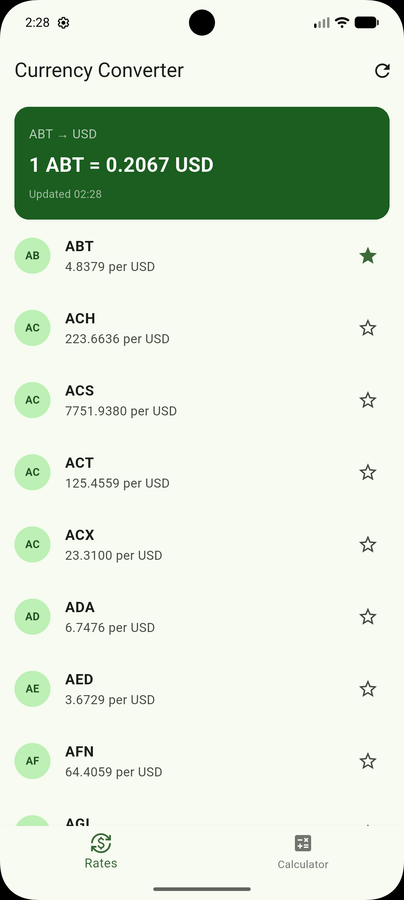
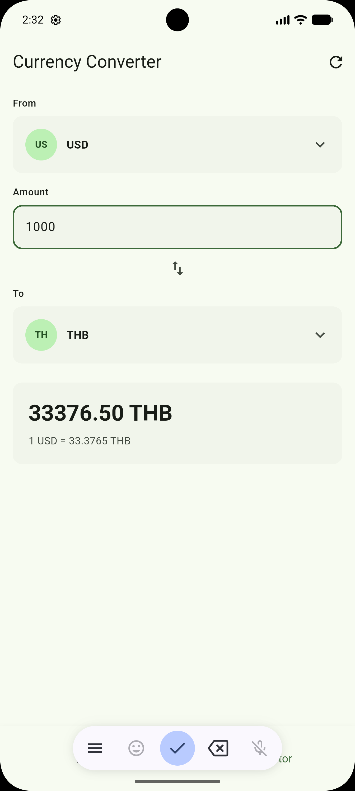
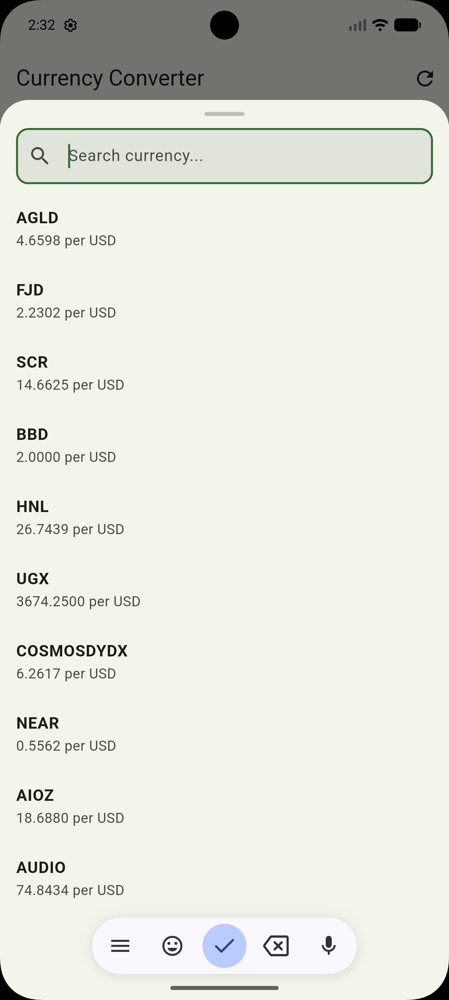
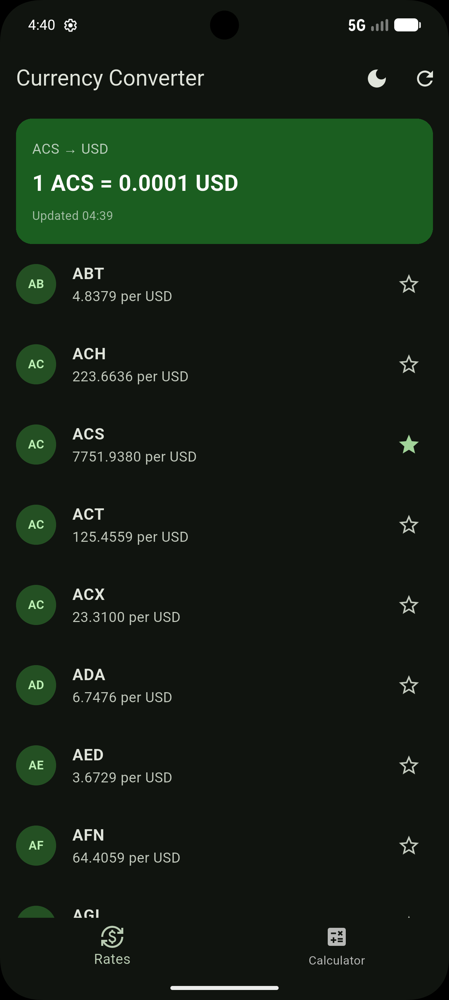
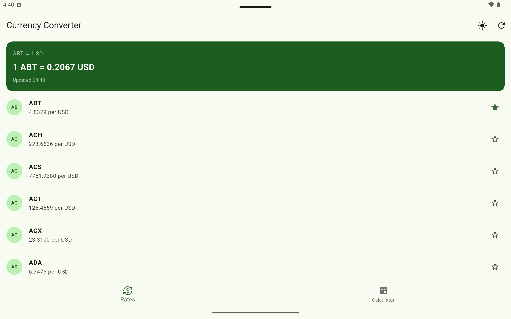
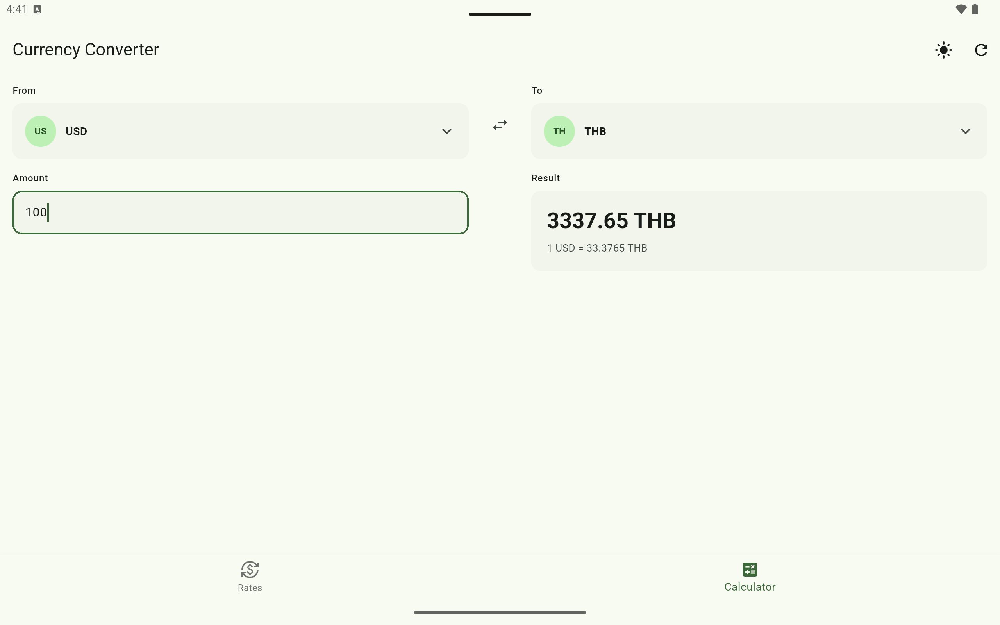
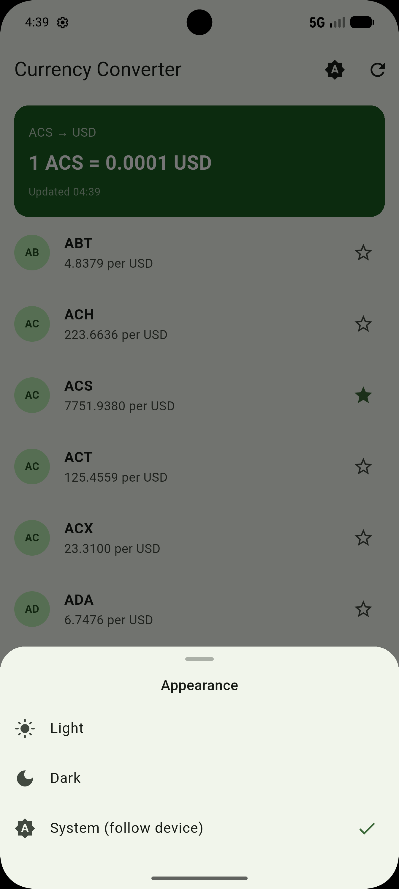

# Currency Converter

## Overview

An offline-first currency converter built as a take-home assessment for Vietpay. Fetches live exchange rates from the [CurrencyFreaks API](https://currencyfreaks.com), caches them locally with Drift, and always reads from the local database — so the app works with or without a network connection.

Built with Flutter, Clean Architecture, and BLoC state management.

## Screenshots

### Phone

| Rates Screen | Calculator | Currency Picker | Dark Mode |
|---|---|---|---|
|  |  |  |  |

### Tablet & Features

| Tablet Rates | Tablet Calculator | Theme Picker |
|---|---|---|
|  |  |  |

## Architecture

The project follows Clean Architecture with three layers:

```
lib/
├── data/          # Drift DB, Dio networking, repository implementations
├── domain/        # Pure Dart models, repository interfaces (no Flutter imports)
└── presentation/  # BLoC/Cubit, screens, widgets
```

### Offline-First Approach

1. **On launch** — `fetchAndCacheRates()` calls the network and writes results to Drift
2. **On failure** — the exception is caught silently; the UI falls back to whatever is in the DB
3. **Always** — the UI subscribes to Drift streams; it never reads directly from the network

This means the app is usable immediately after first install (once data is cached) and survives flaky connections without any user-visible errors.

## Tech Stack

| Concern | Choice |
|---|---|
| Language | Dart 3.4 |
| Architecture | Clean Architecture (data / domain / presentation) |
| State Management | flutter_bloc 8 (BLoC + Cubit) |
| Database | Drift (SQLite, reactive streams) |
| Networking | Dio |
| Dependency Injection | GetIt |
| Testing | bloc_test, mocktail, flutter_test |
| Linting | flutter_lints |

## Key Design Decisions

- **Drift over Hive/SharedPreferences** — Drift provides typed SQL tables, reactive `Stream` queries, and joins. The saved-currency feature requires a JOIN between two tables, which is trivial in Drift and painful in key-value stores.

- **Reactive JOIN stream for saved currency** — `watchSavedCurrencyWithRate()` uses an `innerJoin` so the UI receives a fully hydrated `CurrencyRate` (with the live rate) whenever either the saved currency or the rates table changes. No polling, no manual lookups.

- **CalculatorCubit stores codes, not objects** — storing `String? fromCurrencyCode` instead of `CurrencyRate?` means the calculator always computes its result from the latest rates in `RatesBloc` on every rebuild. Rate updates (after a background refresh) are reflected immediately without any cubit intervention.

- **Atomic transaction for saved currency** — `upsertSavedCurrency()` wraps the `DELETE` + `INSERT` in a single Drift `transaction()`, preventing the reactive JOIN stream from emitting a transient `null` between the two operations.

- **Dual-stream RatesBloc with `Future.wait`** — `watchAllRates()` and `watchSavedCurrency()` are subscribed to concurrently via `Future.wait([emit.forEach(...), emit.forEach(...)])`. Each `onData` reads the latest `state` to preserve the other stream's value, so neither subscription clobbers the other.

- **`fetchAndCacheRates()` returns `bool`** — instead of a silent `void`, the method returns `true` on success and `false` on catch. `RatesBloc` uses this to set `isUsingCache` accurately and to show a "cached data" badge in the UI when the last network attempt failed.

- **Responsive layout** — `CalculatorScreen` uses `OrientationBuilder` to switch between a single-column portrait layout and a two-column landscape layout, sharing extracted widgets (`_CurrencySelector`, `_AmountInput`, `_ResultCard`) with zero duplication.

- **Theme persistence** — Selected theme (Light/Dark/System) is persisted via `SharedPreferences` and restored on next launch, with no flash of wrong theme on startup.

## Setup

1. **Clone the repo**
   ```bash
   git clone https://github.com/htetarkarzaw/currency-converter-vietpay.git
   cd currency-converter-vietpay
   ```

2. **Add your API key**

   Open `lib/core/constants/api_constants.dart` and replace `YOUR_API_KEY` with your [CurrencyFreaks](https://currencyfreaks.com) API key:
   ```dart
   const String apiKey = 'your_key_here';
   ```

3. **Install dependencies**
   ```bash
   flutter pub get
   ```

4. **Generate Drift code**
   ```bash
   dart run build_runner build --delete-conflicting-outputs
   ```

5. **Run the app**
   ```bash
   flutter run
   ```

## Testing

```bash
flutter test
```

Tests are organised by layer:

```
test/
├── bloc/
│   ├── rates_bloc_test.dart
│   └── calculator_cubit_test.dart
└── screens/
    └── home_screen_test.dart
```

## Project Structure

```
lib/
├── core/
│   └── constants/
│       └── api_constants.dart       # API key and base URL
├── data/
│   ├── local/
│   │   └── database.dart            # Drift AppDatabase (tables + queries)
│   └── repository/
│       └── currency_repository_impl.dart
├── di/
│   └── injection.dart               # GetIt registrations
├── domain/
│   ├── model/
│   │   └── currency_rate.dart       # Pure Dart model (Equatable)
│   └── repository/
│       └── currency_repository.dart # Abstract interface
├── presentation/
│   ├── bloc/
│   │   ├── calculator/
│   │   │   ├── calculator_cubit.dart
│   │   │   └── calculator_state.dart
│   │   └── rates/
│   │       ├── rates_bloc.dart
│   │       ├── rates_event.dart
│   │       └── rates_state.dart
│   ├── screens/
│   │   ├── calculator/
│   │   │   ├── calculator_screen.dart
│   │   │   └── currency_picker_bottom_sheet.dart
│   │   ├── home/
│   │   │   └── home_screen.dart
│   │   └── rates/
│   │       ├── rates_screen.dart
│   │       └── widgets/
│   │           ├── currency_rate_item.dart
│   │           └── saved_currency_card.dart
│   └── theme/
│       └── app_theme.dart           # Material3 light + dark theme
└── main.dart
```
